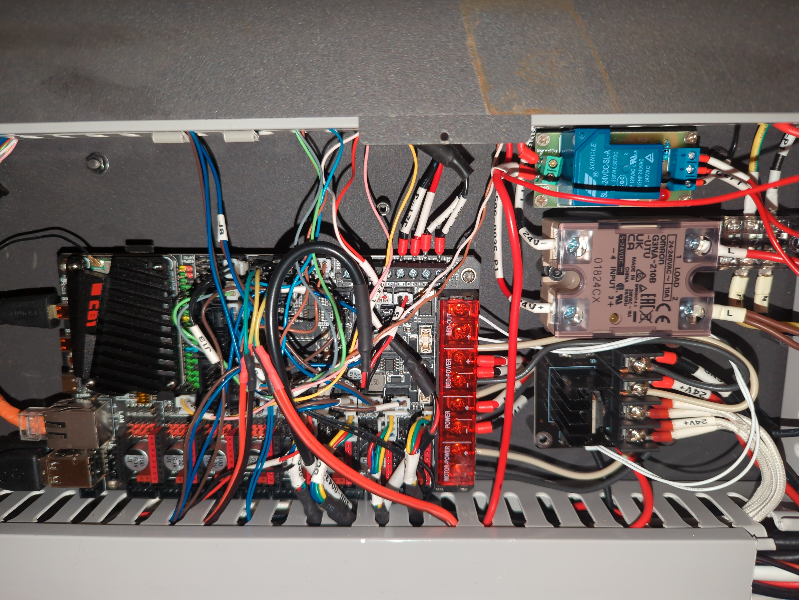

# FunManta
Documenting replacing the controller on a Funmat HT with a Manta M8p

In this document I have wired it with a 1.1 MantaM8p.  Please reference their documentation: [Here](https://github.com/bigtreetech/Manta-M8P/blob/master/V1.0_V1.1/BIGTREETECH%20MANTA%20M8P%20V1.0%26V1.1%20User%20Manual.pdf)

## Pre-flight checklist:
You need jumpers up the wazoo.

Set all VFANs to 24v, there are 7 Fan Headers, if you use my method you will end up using all but one of them

For each of the first 4 driver connections, wire:
1. **MISO TO SLP**
2. **CS to +5V**
3. **SCK to +5V**
4. **MOSI to +5V**

The connections closest to the transistor array below the driver mount should
be jumper'd, all 4 to-be-wired driver slots.

## Fans:
1. Fan0 (Extruder fan): J15
2. Fan1 (Filament Fan): J14
3. Fan2 (Internal 70mm): J20
4. Fan3 (Unused)
5. Fan4 (BBU cooling fan): J10
6. Fan5 (3 pin wired to the chamber heater fan on the left)
7. Fan6 (3 pin wired to the chamber heater fan on the right)

## Power Pins:
1. J41+ to Power+ and jumped to Motor Power+
2. J41- to Power- and jumped to Motor Power-

## Bed Heater:
### Manta M8P won't be able to deal with the bed on this unit, you need an external 120W @ 24v mosfet controller.
Amazon sells them: [Like This](https://www.amazon.com/dp/B078S6221G)

To the bed heater controller, you will wire the main drop from the old bed controller (14ga red wire marked 24V+ and 14ga GND) to the respective inputs on the bed header mosfet, and then jump it to the "BED POWER" + and -

In my case I additionally wired the old battery backup to the bed power + and - pins as well.  They run to a relay above the Chamber's SSR (+24v) and a GND to the BBU board.  (The BBU is currently not functional in my unit)

BED OUT + and - should run to the 2 pin controller header on the Bed heater mosfet controller.  On my Mosfet Pin1 on the control side is wired to Bed Out- and pin 2 is Bed Out+

## Hotend Heater:
1. HE0 -> J21-5 and J21-6
2. HE1 -> J21-3 and J21-4 (These run to the SSR)
	1. J21-4 (Red cable) should be wired to Pin 3+ on the SSR
	2. J21-3 (Black) should be wired to Pin 4- on the SSR

## End Stops:
All of these are <Data>, GND with pull-ups.

1. M1 Stop-> J5
2. M2 Stop-> J8
3. M3 Stop-> J6
4. M4 Stop-> (J23-2 + J203-4)
5. M5 Stop-> J9
6. M6 Stop-> (J203-3, J203-2)
7. M7 Stop-> (J23-1, J203-5)

Most of the endstops need to have their latch removed.

## Motor Drivers:
J27, J28, J29, J30 run to the motor drivers.

I believe They need to be rewired to

Latch up
Blue, Red, Green, Yellow.

J30's latch probably needs to get cut off as it will run into a connector

1. J27 to M1, Blue closest to the Capacitor
2. J28 to M2, Blue closest to the Capacitor
3. J29 to M3, Blue closest to the Capacitor
4. J30 to M4, Blue closest to the Capacitor

## Temp Sensors:
1. THB to J13
2. TH0 to J7
3. TH1 to J11

## Power up:
Follow the instructions from the user manual.  You'll need to build the firmware and generally follow the instructions [Here](https://github.com/bigtreetech/Manta-M8P/tree/master/V1.0_V1.1)

## Configuration
My config utilizes the auto-z library because it's really annoying to deal with the z on this hardware.

Bed leveling does function, but you need to watch it like a hawk first boot to make sure that it isn't giving you some insane z-offset.  Take your time doing the z-offset.
On this hardware if you screw up the z-offset you will drag the hotend really hard and it will likely destroy the PEEK feed tube and probably hop or destroy the belt in addition to your poor bed.

[Auto-z Config](autoz.cfg)
[Printer Config](printer.cfg)

You'll need to replace <REDACTED MCU> with your specific MCU's device id.
